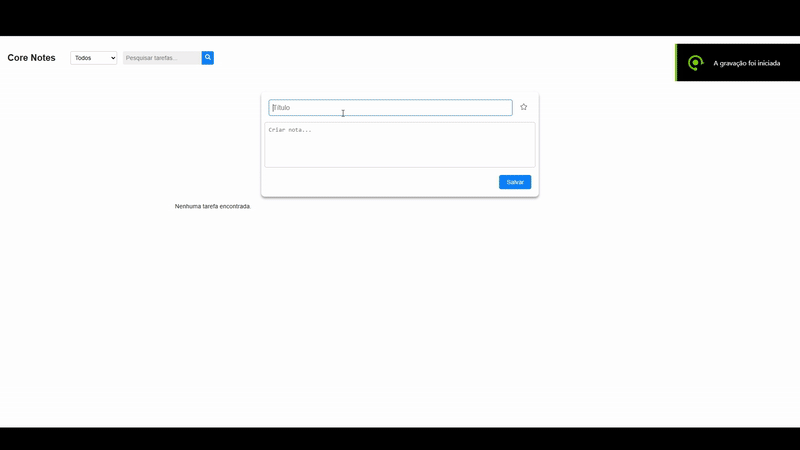

# Core Notes App

O **Core Notes App** é uma aplicação para gerenciar tarefas pessoais ou profissionais. Ele permite criar, editar, excluir, marcar como favorita e alterar o status de tarefas. O sistema também oferece recursos de personalização, como cores para categorizar tarefas, e uma interface responsiva para melhor experiência em dispositivos móveis.

[**Repositorio Back-End**](https://github.com/ArturCampos17/corenotes-backend)

[**Repositorio Front-End** ](https://github.com/ArturCampos17/corenotes-frontend)

## Tecnologias Utilizadas

- **Backend:**
  - **Node.js**: Ambiente de execução JavaScript para construir o servidor.
  - **Express.js**: Framework minimalista para lidar com rotas e requisições HTTP.
  - **Sequelize**: ORM robusto para Node.js que suporta bancos de dados SQL como PostgreSQL, MySQL, SQLite, etc.
    
- **Frontend:**
  - **React:** Framework JavaScript para construção da interface.
  - **TypeScript:** Tipagem estática para maior segurança e manutenibilidade.
  - **CSS Modules:** Estilização modular para evitar conflitos de classes.
  - **React Icons:** Ícones interativos para ações como favoritar, editar e excluir.

- **Banco de Dados:**
  - MySql 8.0
 
---

## Demonstração do Projeto


Assista ao vídeo de demonstração:

[Assistir Video Completo](https://drive.google.com/drive/folders/1JHy8PQoBNVEB2uu-uPDE63wcInSnyDj2?usp=sharing)

Ou veja o GIF abaixo para uma prévia rápida:



## Funcionalidades Principais

1. **Criação de Tarefas:**
   - Adicione tarefas com título e descrição.
   - Marque tarefas como favoritas.
   - Personalize a cor da tarefa.

2. **Gerenciamento de Tarefas:**
   - Edite títulos e descrições.
   - Altere o status da tarefa (pendente, finalizada, cancelada).
   - Exclua tarefas indesejadas.

3. **Interface Responsiva:**
   - Layout adaptável para telas menores (smartphones e tablets).
   - Efeito de hover desativado em dispositivos móveis para melhor usabilidade.

4. **Color Picker:**
   - Escolha entre uma paleta de cores para categorizar visualmente suas tarefas.
   - O color picker é exibido acima de outros elementos e ajusta-se automaticamente em telas menores.

5. **Filtro de tarefas:**
    - As tarefas sempre são filtras na sequencia, Favoritas, Pendentes, Finalizadas e Canceladas, pode utilizar filtro para ver o status desejado.
    - Filtro com Search All, podendo buscar por nome do titulo ou pela descrição da tarefa

6. **Validações de Negócio:**
   - Garante que as regras de negócio sejam seguidas para manter a integridade dos dados.

---

## Regras de Negócio e Validações

As seguintes validações foram implementadas para garantir que o sistema funcione de acordo com as regras de negócio:

### 1. **Título Obrigatório**
   - **Regra:** O título da tarefa é obrigatório.
   - **Validação:** 
     - Um alerta é exibido ao usuário caso o título esteja vazio ao tentar salvar uma tarefa.
     - A submissão do formulário é bloqueada até que o título seja preenchido.

### 2. **Estado de Favorito**
   - **Regra:** Uma tarefa pode ser marcada ou desmarcada como favorita.
   - **Validação:**
     - O estado de "favorito" é armazenado localmente e enviado ao backend para compatibilidade.
     - O ícone de estrela muda dinamicamente entre preenchido  e vazio para refletir o estado atual.

### 3. **Status da Tarefa**
   - **Regra:** Uma tarefa pode ter três estados principais:
     - **Pendente:** Tarefa ativa, permitindo edição, exclusão e outras ações.
     - **Finalizada:** Tarefa concluída, bloqueando edições e outras ações.
     - **Cancelada:** Tarefa cancelada, bloqueando edições e outras ações.
   - **Validação:**
     - Botões de edição, exclusão e marcação como favorita são desabilitados para tarefas com status "finalizada" ou "cancelada".
     - É possível reabrir uma tarefa finalizada ou cancelada, retornando-a ao estado "pendente".


### 4. **Responsividade do Formulário**
   - **Regra:** O formulário deve ser totalmente funcional em dispositivos móveis.
   - **Validação:**
     - O efeito de hover é desativado em dispositivos móveis para evitar conflitos visuais.

### 7. **Persistência de Dados**
   - **Regra:** Os dados devem ser enviados ao backend no formato correto.
   - **Validação:**
     - Todos os campos obrigatórios são validados antes do envio.

---

## Estrutura do Projeto Front - End

```
src/
├── components/
├── FilterBar/
│   │   ├── FilterBar.module.scss
│   │   └── FilterBar.tsx
│   ├── TaskForm/
│   │   ├── TaskForm.tsx
│   │   └── TaskForm.module.scss
│   ├── TaskItem/
│   │   ├── TaskItem.tsx
│   │   └── TaskItem.module.scss
│   └── TaskList/
│       └── TaskList.tsx
├── hooks/
│       └── useTasks.ts
├── App.tsx
├── index.tsx
└── styles/
    └── global.scss
```

### Componentes Principais

- **TaskForm:** Formulário para adicionar ou editar tarefas.
- **TaskItem:** Card individual para exibir e gerenciar uma tarefa.
- **App:** Componente principal que renderiza a lista de tarefas e o formulário.

---

## Estrutura do Projeto Back - End

```
backend/
  ├── config/
  │   ├── connection.js
  │   └── db.js
  ├── controllers/
  │   └── taskController.js
  ├── models/
  │   └── Task.js
  ├── routes/
  │   └── taskRoutes.js
  └── server.js
```

---

## **Modo de Execução do Projeto**

Este projeto pode ser executado de duas maneiras: manualmente ou usando **Docker**. Abaixo estão as instruções para ambos os métodos.

---

### **Método 1: Executar Manualmente**

#### **Backend**
1. Clone o repositório:
   ```bash
   git clone https://github.com/ArturCampos17/corenotes-backend.git
   cd corenotes-backend
   ```
2. Instale as dependências:
   ```bash
   npm install
   ```
3. Configure as variáveis de ambiente:
   - Renomeie `.env.example` para `.env`.
   - Preencha as variáveis conforme necessário (ex.: URL do banco de dados).
4. Inicie o servidor:
   ```bash
   npm start
   ```

#### **Frontend**
1. Clone o repositório:
   ```bash
   git clone https://github.com/ArturCampos17/corenotes-frontend.git
   cd corenotes-frontend
   ```
2. Instale as dependências:
   ```bash
   npm install
   ```
3. Inicie o servidor de desenvolvimento:
   ```bash
   npm start
   ```

---

### **Método 2: Executar com Docker**

#### **Pré-requisitos**
- **Docker:** Instale o Docker em sua máquina ([Docker Desktop](https://www.docker.com/products/docker-desktop)).
- **Docker Compose:** Já incluído no Docker Desktop.

#### **Passos**
1. Clone os repositórios:
   ```bash
   git clone https://github.com/ArturCampos17/corenotes-backend.git
   git clone https://github.com/ArturCampos17/corenotes-frontend.git
   ```
2. Navegue até o diretório raiz do projeto (onde está o `docker-compose.yml`):
   ```bash
   cd caminho/para/diretorio-raiz
   ```
3. Execute o comando para iniciar os serviços:
   ```bash
   docker-compose up --build
   ```

#### **Acessar o Projeto**
- **Frontend:** [http://localhost:3000](http://localhost:3000)
- **Backend:** [http://localhost:3001](http://localhost:3001)
- **Banco de Dados MySQL:** Acessível na porta `3306`.

#### **Parar os Serviços**
Para parar os contêineres, pressione `Ctrl + C`. Para remover os contêineres:
```bash
docker-compose down
```

---

### **Resolução de Problemas**

- **Portas Ocupadas:** Se houver conflito de portas, altere as portas no arquivo `docker-compose.yml`.
- **Backend Não Conecta ao Banco de Dados:** Certifique-se de que o serviço `database` está saudável antes de iniciar o backend.

---

### **Pronto!**

Agora você pode executar o projeto de forma tradicional ou usando Docker. Se precisar de mais ajuda ou tiver dúvidas, consulte a documentação oficial do Docker ou pergunte aqui! 😊
